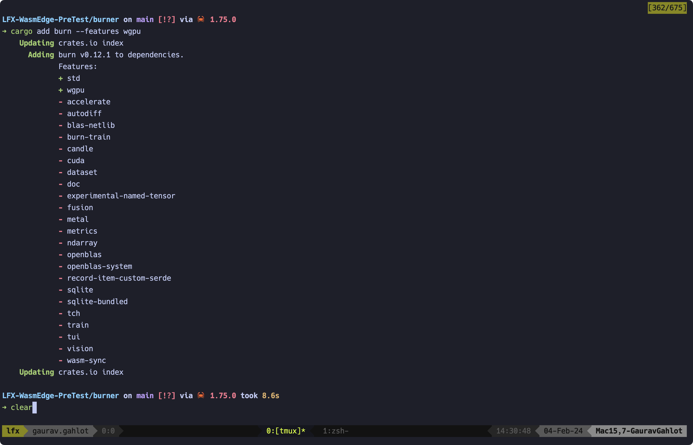

# LFX Mentorship WasmEdge 2024-01 Pre-test

Issue Applied For - [#3172 - Integrate burn.rs as a new WASI-NN backend][1]

## Table of Contents

- [Host Environment](#host-environment)
- [Framework Execution - Burn](#framework-execution---burn)
  - [Project Setup](#project-setup)
  - [Code](#code)
  - [Build and Run](#build-and-run)
- [Build WasmEdge Rustls Plug-in](#build-wasmedge-rustls-plug-in)
  - [Dependencies](#dependencies)
  - [Build and Install Plug-in](#build-and-install-plug-in)
- [Run Examples](#run-examples)
  - [Install wasm target](#install-wasm-target)
  - [WasmEdge Reqwest Demo](#wasmedge-reqwest-demo)
  - [WasmEdge Hyper Demo](#wasmedge-hyper-demo)

## Host Environment

```sh
➜ uname -a
Darwin Mac15,7-GauravGahlot 23.2.0 Darwin Kernel Version 23.2.0: Wed Nov 15 21:54:51 PST 2023; root:xnu-10002.61.3~2/RELEASE_ARM64_T6030 arm64
```

## Framework Execution - Burn

### Project Setup

- Initialize a project directory with Cargo:

    ```sh
    LFX-WasmEdge-PreTest on main [!?] via 🦀 1.75.0
    ➜ cargo new burner
        Created binary (application) `burner` package

    ➜ cd burner
    ```

- Add `burn` dependency:

    

### Code

Update `src/main.rs` with the following code:

```rust
use burn::tensor::Tensor;
use burn::backend::Wgpu;

// Type alias for the backend to use.
type Backend = Wgpu;

fn main() {
    let device = Default::default();

    // Creation of two tensors, the first with explicit values and the
    // second one with ones, with the same shape as the first.
    let tensor_1 = Tensor::<Backend, 2>::from_data([[2., 3.], [4., 5.]], &device);
    let tensor_2 = Tensor::<Backend, 2>::ones_like(&tensor_1);

    // Print the element-wise addition (done with the WGPU backend) of the two tensors.
    println!("{}", tensor_1 + tensor_2);
}
```

### Build and Run

Run the app using the following command:

```sh
cargo run
```


## Build WasmEdge Rustls Plug-in

### Dependencies

- Install dependencies:

    ```sh
    req

    # install cmake
    brew install cmake

    # install the WasmEdge runtime
    curl -sSf https://raw.githubusercontent.com/WasmEdge/WasmEdge/master/utils/install.sh | bash
    source $HOME/.wasmedge/env
    ```

- Verify dependencies:

    ```sh
    ➜ cargo version
    cargo 1.75.0 (1d8b05cdd 2023-11-20)

    ➜ cmake --version
    cmake version 3.28.2
    CMake suite maintained and supported by Kitware (kitware.com/cmake).
    ```

### Build and Install Plug-in

- Clone [WasmEdge][2] with `hydai/0.13.5_ggml_lts` branch, and navigate to
Rustls plug-in directory:

    ```sh
    ➜ git clone git@github.com:WasmEdge/WasmEdge.git -b hydai/0.13.5_ggml_lts
    ➜ cd WasmEdge/plugins/wasmedge_rustls
    ```

- Build the plug-in:
    ```sh
    WasmEdge/plugins/wasmedge_rustls on hydai/0.13.5_ggml_lts via 🦀 1.75.0 
    ➜ cargo build --release
    Compiling libc v0.2.153
    Compiling proc-macro2 v1.0.78
    Compiling cfg-if v1.0.0
    Compiling unicode-ident v1.0.12
    Compiling untrusted v0.9.0
    Compiling spin v0.9.8
    Compiling wasmedge_sys_ffi v0.13.0
    Compiling paste v1.0.14
    Compiling thiserror v1.0.56
    Compiling untrusted v0.7.1
    Compiling log v0.4.20
    Compiling rustls v0.20.9
    Compiling bytes v1.5.0
    Compiling quote v1.0.35
    Compiling syn v2.0.48
    Compiling getrandom v0.2.12
    Compiling thiserror-impl v1.0.56
    Compiling cc v1.0.83
    Compiling ring v0.17.7
    Compiling ring v0.16.20
    Compiling wasmedge_plugin_sdk v0.2.0
    Compiling webpki v0.22.4
    Compiling sct v0.7.1
    Compiling webpki-roots v0.22.6
    Compiling wasmedge_rustls_plugin v0.2.0 (/Users/gaurav.gahlot/workspace/WasmEdge/plugins/wasmedge_rustls)
        Finished release [optimized] target(s) in 6.46s
    ```

- Install the plugin by copying the generated `.dylib`
    
    ```sh
    ➜ cp target/release/libwasmedge_rustls.dylib ~/.wasmedge/plugin/
    ```

## Run Examples

### Install wasm target 

```sh
➜ rustup target add wasm32-wasi
info: downloading component 'rust-std' for 'wasm32-wasi'
info: installing component 'rust-std' for 'wasm32-wasi'
```

### WasmEdge Reqwest Demo

- Clone the example repository

    ```sh
    ➜ gh repo clone git@github.com:WasmEdge/wasmedge_reqwest_demo.git
    ➜ cd wasmedge_reqwest_demo
    ```

- Build with `wasm32-wasi` target:

    ```sh
    wasmedge_reqwest_demo on main [?] via 🦀 1.75.0
    ➜ cargo build --target wasm32-wasi --release
       Compiling libc v0.2.153
       Compiling autocfg v1.1.0
       Compiling wasi v0.11.0+wasi-snapshot-preview1
       Compiling proc-macro2 v1.0.78
       ...
       Compiling tokio-util_wasi v0.7.5
       Compiling wasmedge_rustls_api v0.1.1
       Compiling h2_wasi v0.3.15
       Compiling hyper_wasi v0.15.2
       Compiling wasmedge_hyper_rustls v0.1.1
       Compiling reqwest_wasi v0.11.16
       Compiling wasmedge_reqwest_demo v0.1.0 (/Users/gaurav.gahlot/workspace/playground/wasmedge_reqwest_demo)
        Finished release [optimized] target(s) in 9.62s
    ```

- Run the demo (`https` client):

    ```sh
    wasmedge_reqwest_demo on main [?] via 🦀 1.75.0
    ➜ wasmedge target/wasm32-wasi/release/https.wasm
    ```

    <details>
        <summary>Output</summary>

        ➜ wasmedge target/wasm32-wasi/release/https.wasm
        [2024-02-04 19:05:01.369] [error] instantiation failed: module name conflict, Code: 0x60
        [2024-02-04 19:05:01.369] [error]     At AST node: module
        Fetching "https://eu.httpbin.org/get?msg=WasmEdge"...
        Response: HTTP/1.1 200 OK
        Headers: {
            "date": "Sun, 04 Feb 2024 13:35:03 GMT",
            "content-type": "application/json",
            "content-length": "265",
            "connection": "keep-alive",
            "server": "gunicorn/19.9.0",
            "access-control-allow-origin": "*",
            "access-control-allow-credentials": "true",
        }

        GET: {
        "args": {
            "msg": "WasmEdge"
        },
        "headers": {
            "Accept": "*/*",
            "Host": "eu.httpbin.org",
            "X-Amzn-Trace-Id": "Root=1-65bf9287-3fa296f70fa8d7890494ea9d"
        },
        "origin": "103.59.75.139",
        "url": "https://eu.httpbin.org/get?msg=WasmEdge"
        }

        POST: {
        "args": {},
        "data": "msg=WasmEdge",
        "files": {},
        "form": {},
        "headers": {
            "Accept": "*/*",
            "Content-Length": "12",
            "Host": "eu.httpbin.org",
            "X-Amzn-Trace-Id": "Root=1-65bf9288-05c8c10701fd6e347362a518"
        },
        "json": null,
        "origin": "103.59.75.139",
        "url": "https://eu.httpbin.org/post"
        }

        PUT: {
        "args": {},
        "data": "msg=WasmEdge",
        "files": {},
        "form": {},
        "headers": {
            "Accept": "*/*",
            "Content-Length": "12",
            "Host": "eu.httpbin.org",
            "X-Amzn-Trace-Id": "Root=1-65bf9288-1e4f0c0f16c293b043a1a82a"
        },
        "json": null,
        "origin": "103.59.75.139",
        "url": "https://eu.httpbin.org/put"
        }
    </details>

### WasmEdge Hyper Demo

- Clone the example repository

    ```sh
    ➜ gh repo clone git@github.com:WasmEdge/wasmedge_hyper_demo.git
    ➜ cd wasmedge_hyper_demo/client
    ```

- Build with `wasm32-wasi` target:

    ```sh
    wasmedge_hyper_demo/client on main [?] via 🦀 1.75.0
    ➜ cargo build --target wasm32-wasi --release
       Compiling autocfg v1.1.0
       Compiling cfg-if v1.0.0
       Compiling quick-error v1.2.3
       Compiling wasi v0.11.0+wasi-snapshot-preview1
       ...
       Compiling wasmedge_wasi_socket v0.5.3
       Compiling mio_wasi v0.8.9
       Compiling tokio-util_wasi v0.7.5
       Compiling h2_wasi v0.3.15
       Compiling hyper_wasi v0.15.2
       Compiling wasmedge_hyper_client v0.1.0 (/Users/gaurav.gahlot/workspace/playground/wasmedge_hyper_demo/client)
        Finished release [optimized] target(s) in 11.50s
    ```

- Run the demo (`https` client):

    ```sh
    wasmedge_hyper_demo/client on main [?] via 🦀 1.75.0 took 11.6s
    ➜ wasmedge target/wasm32-wasi/release/wasmedge_hyper_client.wasm
    ```

    <details>
        <summary>Output</summary>

        ➜ wasmedge target/wasm32-wasi/release/wasmedge_hyper_client.wasm
        [2024-02-04 23:38:42.832] [error] instantiation failed: module name conflict, Code: 0x60
        [2024-02-04 23:38:42.833] [error]     At AST node: module

        GET as byte stream: http://eu.httpbin.org/get?msg=Hello
        Response: 200 OK
        Headers: {
            "date": "Sun, 04 Feb 2024 18:08:44 GMT",
            "content-type": "application/json",
            "content-length": "236",
            "connection": "keep-alive",
            "server": "gunicorn/19.9.0",
            "access-control-allow-origin": "*",
            "access-control-allow-credentials": "true",
        }

        b"{\n  \"args\": {\n    \"msg\": \"Hello\"\n  }, \n  \"headers\": {\n    \"Host\": \"eu.httpbin.org\", \n    \"X-Amzn-Trace-Id\": \"Root=1-65bfd2ac-4e512bc647c75c8e5e9f7c96\"\n  }, \n  \"origin\": \"103.59.75.209\", \n  \"url\": \"http://eu.httpbin.org/get?msg=Hello\"\n}\n"

        GET and get result as string: http://eu.httpbin.org/get?msg=WasmEdge
        {
        "args": {
            "msg": "WasmEdge"
        },
        "headers": {
            "Host": "eu.httpbin.org",
            "X-Amzn-Trace-Id": "Root=1-65bfd2ac-39840d8c33f3c1e0351758ec"
        },
        "origin": "103.59.75.209",
        "url": "http://eu.httpbin.org/get?msg=WasmEdge"
        }


        POST and get result as string: http://eu.httpbin.org/post
        with a POST body: hello wasmedge
        {
        "args": {},
        "data": "hello wasmedge",
        "files": {},
        "form": {},
        "headers": {
            "Content-Length": "14",
            "Host": "eu.httpbin.org",
            "X-Amzn-Trace-Id": "Root=1-65bfd2ad-7bacbdcd429dad1f407376ac"
        },
        "json": null,
        "origin": "103.59.75.209",
        "url": "http://eu.httpbin.org/post"
        }


    </details>

[1]: https://github.com/WasmEdge/WasmEdge/issues/3172
[2]: https://github.com/WasmEdge/WasmEdge/tree/hydai/0.13.5_ggml_lts
